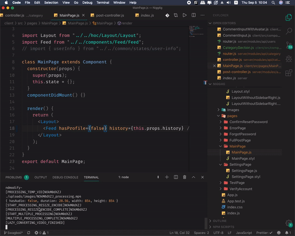
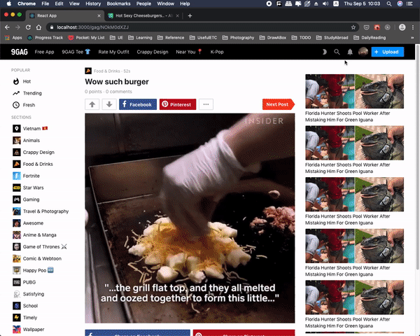

# NigG4g

## Introduction
An unoffical clone of 9Gag. Made with purpose of learning web development in general.

What we aim to do is whatever we make, it should function as close as possible as 9Gag (of course just to some level since there are more factors other than skills and algorithm).

## Overview
- One page app with:
  - Front-end: React App
  - Back-end: Node.js HTTPs
- HTML Styling: Stylus
- Database: MongoDB Atlas
- Video/ Image Processing : FFmpeg

## Made Feature (until 17 July):
- Authentication
- Feed View
- Single Post View
- Vote, Comment, Report
- Upload Post
- Account Settings

## Technical Feature:
- Infinite Scroll
- Modal System, Customized Cached System, State System, Event System (greatly thanks to Tuan Anh and his currently working place)
- Redux-free
- Customized RESTful API "communicator" for front-end to connect to back-end
- Facebook, Google Login
- Post Model: 
  - Completely equivalent to 9Gag, can imported from 9Gag's post database with ease
  - Multiple Image/ Video size and type for multiple platform using:
    - Image: jpg, webp
    - Video: jpg (thumbnails), webm: vp9, webm: normal webm, mp4: normal mp4, mp4: h265
    - Size: 460 and 700 (for single post and feed)
  - Lazy convert Image/ Video for faster uploading post:
    - When user upload a post, only need one type of each dimension then the post is made and out to the world.
    - After the post is posted, the system starts to convert the rest.
  - Web scraper is used for scraping image/ video from pages like imgur (pages that is not image-only but an "image container" with other stuff in it)
  - Customized Media Player: Automatically stop playing vids when out of boundaries.
  - Stylus Compiler: Self-made bash .sh file help to compile stylus real-time.

## Preview:
### Feed

### Login

### Single Post

### Upload Image

### Upload Video

### Lazy Converting Video/ Image

### Account Page


## Installation:
  - Prerequisite: Stylus, FFmpeg (such that it can run in cmd)
  - Only test with 4 computers so there might not be work with you, email me at termanteus@gmail.com if need help of course.
  
  Current directory: .../Nigg4g
  ```
    npm install
    cd server && npm install 
    cd ../client && npm install
    cd ..
    Linux: npm start
    Window: npm run start-w 
  ```

## Feature that is not to be made (sadly):
  - Optimizing Page such as: Lazy load components,...
  - Feed filtered by tags, categories (missing front-end), Hot/ Trending
  - Searching (missing front-end)
  - User's Feed
  - OG-tag for sharing
  - Night mode
  - Notification Systems
  - Moving Image/ Video Processing to another server so that it can process faster and be capable to response to many request.


## What I Learned:
- Web Dev:
  - Before starting this project, what I know about Web dev in general and React, Node.js in particular is very scarce, since I've been a game dev for a while using C++ and Unreal Engine 4. So here is some summary of some techniques that I currently remember to write down for now:
    - React:
      - All in the Features sections:
        - Component-Based Design
        - Redux workaround: Using custom cached, state design
        - Custom API "communicator"
        - Router
        - .env
        - What not to do and not able to do in front-end
    - Node.js:
      - More compacted and easy to control Model, Controller for each model.
      - HTTPs server: create key, messing around with cert and use those with express.js
      - Image/ Video Processing using ffmpeg
      - Hot/Trending algorithm: eventhough this is not made into the final version, I've already been reading a bunch about these and gathered some knowledge for myself.
      - Recursive Comment
    - HTML, CSS:
      - Before this project, I have zero knowledge at all, then my friend suggested me learning Stylus and now I can somewhat write and style a webpage.
    - DevOps:
      - I sensed a slight slight VERY slight of what a devOps might be doing and it feels like devOps is a very OP people <3.

## Contributors
This project is created at June 21 2019 by me (Dao Tuan Trung) and Nguyen Khac Minh. Nigg4g was being continously commited until July 18 and then have been "abandoned" from since due to life schedule of both of us.

Greatly thank Nguyen Khac Minh for his contribution. NKM solely made the front-end nav-bar, toolbar, sidebar and the whole account's settings page, also very funny 404 page (original to 9Gag).